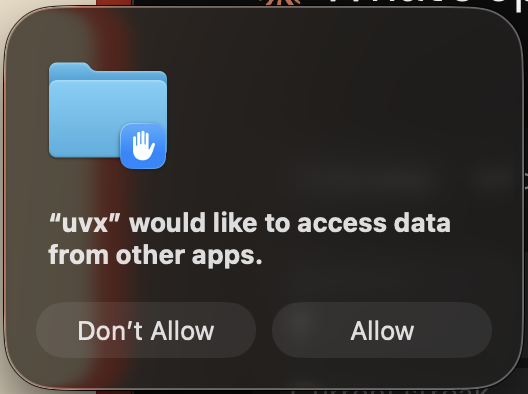

# Apple Books MCP

<!-- mcp-name: io.github.vgnshiyer/apple-books-mcp -->

Model Context Protocol (MCP) server for Apple Books.

[](https://vgnshiyer.me/AppleBooksMcp)

[](https://pypi.org/project/apple-books-mcp/)
[](https://opensource.org/licenses/Apache-2.0)
[](https://www.linkedin.com/comm/mynetwork/discovery-see-all?usecase=PEOPLE_FOLLOWS&followMember=vgnshiyer)
[](https://www.buymeacoffee.com/vgnshiyer)

## At a glance

* **Pick up where you left off** — Claude sees the book you're reading, your progress and the chapter you're on, and pulls that chapter's text (`chapter_id="current"`) and your highlights when it needs them.
* **Find any book** — by title or author, ignoring case, accents and curly quotes, with a link that opens it in Apple Books.
* **Expand on any highlight** — get the surrounding paragraph explained in context, with the exact anchor you marked shown in `«...»`.
* **Revisit a book** — pull your highlights, cluster them by theme, and quote you back to yourself.
* **Reflect on your reading** — patterns across books, recurring ideas in your highlights, what you're actually drawn to.

https://github.com/user-attachments/assets/77a5a29b-bfd7-4275-a4af-8d6c51a4527e

And much more!

## Available Tools

List and search tools return one page at a time: 50 annotations or 200 books by default, `limit` between 1 and 500, and `offset` for the next page. When there is more, the output says so and names the next `offset`.

How results work:

* Ids are integers: every row starts with one, as in `[175] Title by Author`, to pass on as `book_id`, `annotation_id` or `collection_id`. A numeric string such as `"175"` is accepted too; `true`, `false` and fractions are not ids.
* A failure (an unknown id, a book that isn't downloaded, a bad `color`) comes back as an MCP error (`isError`) whose message names what to do next, often another tool to call. An empty result ("No books matched …") is a normal answer, not an error.
* Text taken from your books (chapter text, the passage around a highlight, a table of contents, a book's description) is wrapped in `<book_text>…</book_text>`. The server's instructions tell Claude that this text is untrusted data from the book, never instructions to follow.
* Highlights from books you've removed from the library are kept by Apple Books. They are shown per removed book, as "Removed book (asset 3F2A1B2C…)", after the books still in your library.

### Collections

| Tool | Description | Parameters |
|------|-------------|------------|
| list_all_collections | List all collections | limit?: int (default: 200), offset?: int |
| get_collection_books | Get all books in a collection | collection_id: int |
| describe_collection | Get details of a collection | collection_id: int |
| search_collections_by_title | Search for collections by title | title: str |

### Editing collections (opt-in)

Off by default. Enable by adding `--enable-writes` to the server args:

```json
"args": ["apple-books-mcp", "--enable-writes"]
```

With the [Claude Desktop extension](#claude-desktop-extension-mcpb), turn on **Allow editing collections** in the extension's settings instead.

Apple provides no automation API for collections, so these write directly to the library database — behind guard rails: every write **refuses while Books is open**, takes an automatic WAL-safe backup first (`~/.py_apple_books/backups/`), validates the schema and aborts on drift, and only touches user-created collections (plus "Want to Read" membership). Deleting a collection never deletes the books in it.

> ⚠️ If iCloud sync for collections is enabled, direct edits may not propagate to other devices and can be reverted by a cloud re-sync.

| Tool | Description | Parameters |
|------|-------------|------------|
| create_collection | Create a new collection | title: str, details?: str |
| rename_collection | Rename a user-created collection | collection_id: int, new_title: str |
| delete_collection | Delete a user-created collection (books untouched) | collection_id: int |
| add_book_to_collection | Add a book to a collection (idempotent) | collection_id: int, book_id: int |
| remove_book_from_collection | Remove a book from a collection (idempotent) | collection_id: int, book_id: int |

### Books

| Tool | Description | Parameters |
|------|-------------|------------|
| list_all_books | List all books | limit?: int (default: 200), offset?: int |
| search_books | Find books whose title or author contains the query, ignoring case, accents and quote/dash style | query: str, limit?: int (default: 200), offset?: int |
| search_books_by_title | Search for books by title (same matching, titles only) | title: str, limit?: int (default: 200), offset?: int |
| describe_book | Get details of a particular book (metadata, progress, annotation count, description), whether its text is readable (see below) and an "Open in Books" link | book_id: int |
| list_annotations | Annotations for a book in reading order (id + text + chapter per row, with your notes) | book_id: int, limit?: int (default: 50), offset?: int |
| get_books_by_genre | Get books by genre (substring match) | genre: str, limit?: int (default: 200), offset?: int |

`describe_book` has a **Readable text** line saying whether the chapter tools can read the book, and if not why: `yes (EPUB)`, a PDF, DRM-protected, not downloaded (in iCloud only, an Apple Books Store title, or never downloaded) or a missing file. It is worked out from the library's records and file metadata, without opening the book: reading a file that is only in iCloud would make macOS download it.

**Open in Books** links (`ibooks://assetid/…`) open the book in Apple Books. They appear in `describe_book`, `describe_annotation`, `get_current_reading_position` and the Currently Reading resource.

### Reading Status

| Tool | Description | Parameters |
|------|-------------|------------|
| get_books_in_progress | Get books currently being read | limit?: int (default: 200), offset?: int |
| get_finished_books | Get books that have been finished | limit?: int (default: 200), offset?: int |
| get_unstarted_books | Get books not yet started | limit?: int (default: 200), offset?: int |
| get_recently_read_books | Get the most recently read books | limit?: int (default: 10), offset?: int |

### Annotations

| Tool | Description | Parameters |
|------|-------------|------------|
| list_all_annotations | Browse every annotation grouped by book, newest first, with your notes | limit?: int (default: 50), offset?: int |
| recent_annotations | Get most recent annotations (flat, with date + book per row) | limit?: int (default: 10), offset?: int |
| describe_annotation | Get full details of a single annotation, with the book's "Open in Books" link | annotation_id: int |
| get_annotation_context | Text window around a highlight (the paragraph it's in), with the highlight marked `«...»` | annotation_id: int, chars_before?: int (default: 500), chars_after?: int (default: 500) |
| get_highlights_by_color | Highlights of a particular color, grouped by book | color: yellow\|green\|blue\|pink\|purple, limit?: int (default: 50), offset?: int, order_by?: newest\|oldest |
| search_notes | Search user notes (shows highlight + note inline) | note: str, limit?: int (default: 50), offset?: int, order_by?: newest\|oldest |
| search_annotations | Search across highlights + notes + surrounding text (shows notes inline) | text: str, limit?: int (default: 50), offset?: int, order_by?: newest\|oldest |
| get_annotations_by_date_range | Annotations within a date range, inclusive of the `before` day, local time (flat, with date + book per row) | after?: YYYY-MM-DD, before?: YYYY-MM-DD, limit?: int (default: 50), offset?: int, order_by?: newest\|oldest |

### Library Stats

| Tool | Description | Parameters |
|------|-------------|------------|
| get_library_stats | Get library summary with reading stats | None |

### Book Content

Only works for non-DRM EPUBs downloaded to this Mac (imported books, Project Gutenberg, Standard Ebooks, etc.). Apple Books Store purchases are usually FairPlay-protected and return a clear error, and iCloud-only books a "not downloaded" hint; `describe_book`'s "Readable text" line tells in advance.

| Tool | Description | Parameters |
|------|-------------|------------|
| list_book_chapters | Table of contents for a book (chapter titles, order, nesting) | book_id: int |
| get_chapter_content | Plain-text content of a chapter, with optional `offset` + `max_chars` slicing. `chapter_id="current"` (the default) reads the chapter you're on in Apple Books | book_id: int, chapter_id?: str (default: "current"), offset?: int, max_chars?: int |
| get_current_reading_position | The chapter the user last left off reading (via Apple Books' auto-bookmark CFI), with an "Open in Books" link | book_id: int |

## Available Resources

Attachable data objects accessible from Claude Desktop's resource picker.

| Resource | URI | Description |
|----------|-----|-------------|
| Currently Reading | `apple-books://currently-reading` | A short pointer to the book you're reading right now (the most recently opened in-progress book): title, author, book id, progress, an "Open in Books" link, the chapter you left off on with its chapter id (for non-DRM EPUBs; otherwise why its text can't be read), and how many highlights you have in it. It carries no chapter text or highlights; Claude fetches those on demand with `get_chapter_content` and `list_annotations`. Attach to any conversation to focus Claude on your current read. |

## Available Prompts

One-click workflows, accessible from Claude Desktop's prompt picker.

| Prompt | Description | Arguments |
|--------|-------------|-----------|
| weekly_digest | Summarize what I've read and highlighted in the past week | days?: int (default: 7) |
| library_snapshot | A reflection on my whole reading life | None |
| revisit_book | Revisit your notes and highlights from a specific book | book_title: str |

## Installation

### Requirements

* macOS, with Apple Books opened at least once (it creates the library the server reads).
* Python 3.10 or newer. uvx and the Claude Desktop extension provide one if needed.
* Installed with the server: `mcp` >= 1.12 (< 2) and `py-apple-books` >= 1.10 (< 2).

### Using uv (recommended)

[uvx](https://docs.astral.sh/uv/guides/tools/) runs apple-books-mcp without a separate install step.

```bash
brew install uv  # for macos
uvx apple-books-mcp --version
```

The first run downloads about 14 MB of dependencies and can take up to a minute, which is close to how long Claude waits for a server to start. Running the command above once in Terminal warms uv's cache before you add the server to Claude. `--version` prints the apple-books-mcp, mcp and py-apple-books versions uvx resolved.

Then add the server to Claude with the [JSON config](#claude-desktop-setup) or the [Claude Code command](#claude-code-setup) below.

### Claude Desktop extension (.mcpb)

Claude Desktop can also install apple-books-mcp as an extension, without editing its config: download `apple-books-mcp-<version>.mcpb` from the [latest GitHub release](https://github.com/vgnshiyer/apple-books-mcp/releases/latest), double-click it (or open Settings → Extensions → Install Extension… and pick the file), and click **Install**. Desktop installs uv and the locked dependencies itself. **Allow editing collections** in the extension's settings does the same as `--enable-writes`.

On organization-managed Claude (Team/Enterprise), admins can limit Desktop Extensions to an allowlist or turn them off. If the .mcpb install is refused, use the JSON config below. If user-added MCP servers are also disabled by policy, ask your admin to approve the extension.

### Using pip

Needs Python 3.10 or newer (the `python3` that ships with macOS is 3.9). Install into a virtual environment:

```bash
python3 -m venv ~/.venvs/apple-books-mcp
~/.venvs/apple-books-mcp/bin/pip install apple-books-mcp
~/.venvs/apple-books-mcp/bin/apple-books-mcp --version
```

Upgrade later with `~/.venvs/apple-books-mcp/bin/pip install -U apple-books-mcp`.

### Using Docker (deprecated)

> ⚠️ The Docker image is deprecated and only partly works: a Linux container can't be granted the macOS permission, can't reach book files stored in iCloud Drive (so the tools that read book text fail), and can't tell whether Books is running (so collection writes are unsupported). Use uvx instead.

It can still serve library metadata and annotations. Mount the Apple Books container read-only and keep stdin open with `-i`. The image runs as an unprivileged user and reads the library from the same mount path as before:

```bash
docker run -i --rm -v ~/Library/Containers/com.apple.iBooksX/Data/Documents:/root/Library/Containers/com.apple.iBooksX/Data/Documents:ro ghcr.io/vgnshiyer/apple-books-mcp:latest
```

In a Claude config, spell out your home directory: Claude doesn't expand `~`.

```json
{
    "mcpServers": {
        "apple-books-mcp": {
            "command": "docker",
            "args": [
                "run", "-i", "--rm",
                "-v", "/Users/YOU/Library/Containers/com.apple.iBooksX/Data/Documents:/root/Library/Containers/com.apple.iBooksX/Data/Documents:ro",
                "ghcr.io/vgnshiyer/apple-books-mcp:latest"
            ]
        }
    }
}
```

## First-run permission prompt (macOS)

The first time the server reads your library, macOS asks whether the program that started it may "access data from other apps", because Apple Books keeps its library in its own app container (`~/Library/Containers/com.apple.iBooksX/`). Click **Allow**.



macOS asks about the program Claude launches, not about apple-books-mcp itself:

* `uvx` with the recommended Claude Desktop config (the prompt above);
* the Python interpreter with the pip config;
* `claude` when the server is configured in Claude Code;
* your terminal app when you run the server by hand.

The permission belongs to that program, so anything else it launches can use it too. apple-books-mcp only reads the library, plus the book files for chapter text; it changes nothing unless you pass `--enable-writes`.

To check, run `uvx apple-books-mcp --doctor` in Terminal: it reports whether the program running it may read the library and, if not, how to fix it. Run that way it checks your terminal app's permission, which macOS asks about separately from uvx or Claude.

**Asked again after an update?** Homebrew's `uv`/`uvx` and Homebrew or uv-managed Python builds aren't signed by a registered developer, so after `brew upgrade uv` (or a Python upgrade) macOS treats them as a new program and asks again. Click **Allow**.

**Clicked "Don't Allow"?** Tools then fail with "macOS denied access to the Apple Books library". (Older releases failed at startup instead, with "No sqlite files found in … Please open Apple Books at least once".) This permission has no switch in System Settings. To be asked again, run:

```bash
tccutil reset SystemPolicyAppData
```

This clears the "data from other apps" decisions for all apps. Then quit and reopen Claude, and click **Allow**. Adding the program (e.g. `/opt/homebrew/bin/uvx`) to **Full Disk Access** in System Settings > Privacy & Security also works, but grants far more access.

## Configuration

### Claude Desktop Setup

Quit Claude Desktop (Cmd+Q) before editing `~/Library/Application Support/Claude/claude_desktop_config.json`: Desktop rewrites the file while it runs, so edits made while it's open can be lost.

#### Using uvx (recommended)

```json
{
    "mcpServers": {
        "apple-books-mcp": {
            "command": "uvx",
            "args": [ "apple-books-mcp" ]
        }
    }
}
```

Plain `apple-books-mcp` still picks up new releases: uv checks PyPI for a newer version whenever its cached copy of the package index is more than 10 minutes old, which is usually the case when Claude starts. `apple-books-mcp@latest` gains nothing over that and makes uv build a fresh environment on every launch (3–12 s instead of about 1 s).

#### Faster or offline startup

Because uvx checks PyPI at launch, the server won't start while PyPI is unreachable. To avoid that:

* Run `uv tool install apple-books-mcp` once. The same uvx config then uses the installed copy and starts in about a second without contacting PyPI. Installed copies don't update themselves: run `uv tool upgrade apple-books-mcp` to get new releases.
* Or use `"args": ["--offline", "apple-books-mcp"]` to run whatever version uv has already cached (after at least one online run), without any network access.

#### Using pip

Point Claude at the script inside the virtual environment from [Using pip](#using-pip), with your home directory spelled out:

```json
{
    "mcpServers": {
        "apple-books-mcp": {
            "command": "/Users/YOU/.venvs/apple-books-mcp/bin/apple-books-mcp"
        }
    }
}
```

### Claude Code Setup

Claude Code doesn't read the Claude Desktop config. Add the server with:

```bash
claude mcp add --scope user apple-books-mcp -- uvx apple-books-mcp
```

and check it with `/mcp`.

### Environment variables

Set these in the server's `"env"` in the Claude config (e.g. `"env": {"APPLE_BOOKS_MCP_THREADS": "4"}` next to `"args"`), or with `claude mcp add -e NAME=value`.

| Variable | Default | What it does |
|----------|---------|--------------|
| `APPLE_BOOKS_MCP_ENABLE_WRITES` | off | `1`, `true` or `yes` turns on collection editing, like `--enable-writes`. |
| `APPLE_BOOKS_MCP_THREADS` | `8` | How many tool calls run at once. `0` runs them one at a time on the server's event loop, as before 0.9. Lower values also cap memory on very large libraries. |
| `APPLE_BOOKS_DATA_DIR` | Apple Books' own folder | The Apple Books `Documents` folder to read (the one holding `BKLibrary/` and `AEAnnotation/`). |
| `APPLE_BOOKS_QUERY_TIMEOUT` | `30` | Seconds a library query may run before it is stopped; `0` means no limit. |

## Troubleshooting

### Where to look

* `uvx apple-books-mcp --doctor` in Terminal checks the versions, finds the library, explains macOS permission problems and prints counts of what it read. It only reads, and never prints titles or text.
* `~/Library/Logs/Claude/mcp-server-apple-books-mcp.log` (named after your `mcpServers` key) has the server's own output, including Python tracebacks. For more detail, add `"-v"` to the args: the server then logs its version, the mcp and py-apple-books versions it runs with, and each request.
* `~/Library/Logs/Claude/mcp.log` lists failures. Its "Server started and connected successfully" line only means the process was launched, not that it works.
* `~/Library/Logs/Claude/main.log` records "Connected to apple-books-mcp (N tools)" when a Claude Code or Cowork session in Desktop loaded the tools.
* `uvx apple-books-mcp --version` in Terminal shows which versions uvx resolves.

### Common problems

* **"Connection closed", "Server disconnected" or "Server transport closed unexpectedly"**: the server exited at startup. Read the last error in the traceback in `mcp-server-apple-books-mcp.log`.
  * `No module named 'mcp.server.fastmcp'`: uv picked an apple-books-mcp release older than 0.8.1 together with mcp 2.x, which removed the API those releases were built on (on Python 3.12 and older, uvx could even fall back to 0.1.2). 0.8.1 and newer work with Python 3.10+ and stay on mcp 1.x. Run `uv cache clean apple-books-mcp`, check that `uvx apple-books-mcp --version` reports 0.8.1 or newer, then quit and reopen Claude.
  * A `No module named 'server'` error in front of the real one is noise from releases before 0.8.4.
* **"Not ready after 60 seconds" or "Request timed out" at startup**: the first launch was still downloading and installing dependencies. Run `uvx apple-books-mcp --version` once in Terminal, then reopen Claude.
* **"macOS denied access to the Apple Books library"** (older releases: "No sqlite files found in …"): see [First-run permission prompt](#first-run-permission-prompt-macos).
* **"No Apple Books library store found"**: Apple Books hasn't created its library for this macOS user yet. Open Books once, then try again.
* **Stopping a response while a tool runs**: since 0.9 a stopped tool call is answered immediately and the server keeps serving other sessions; the call's remaining work finishes in the background (a write that had already started still completes; one that hadn't started never runs).
* **"Extension apple-books-mcp not found in installed extensions"** in `main.log` is harmless.

### Getting Claude to retry

* **Claude Desktop chats**: quit Claude completely (Cmd+Q) and reopen it. A server that failed to start isn't retried otherwise.
* **Claude Code and Cowork sessions in Desktop**: start a new session; each new session retries the server.
* **Claude Code**: run `/mcp` and reconnect apple-books-mcp, or restart Claude Code.

## Upcoming Features

- [ ] Highlight export: a book's highlights and notes in reading order, with chapter headings
- [ ] Fewer, broader tools in 1.0, where today several overlap
- [ ] Titles for removed books, where Apple Books' caches still hold them
- [ ] PDF content access (currently EPUB-only)

## Contribution

Thank you for considering contributing to this project!

### Development

Clone the repository and let uv create the virtual environment and install the package with its dependencies:

```bash
uv sync
uv run apple-books-mcp --version
uv run pytest
```

To build the Claude Desktop extension locally, install the pinned packer, then build:

```bash
npm ci --ignore-scripts --prefix mcpb
uv run python scripts/build_mcpb.py
```

This writes `dist/apple-books-mcp-<version>.mcpb` and the registry's `dist/server.json` (`--out DIR` picks another folder). `python scripts/build_mcpb.py --smoke dist/apple-books-mcp-<version>.mcpb` installs the bundle the way Claude Desktop does and checks the server it starts.

Maintainers: publishing a GitHub release runs the release workflow, which checks the tag against every version field, publishes to PyPI, attaches the .mcpb to the release and publishes to the MCP Registry.

#### Debugging

Logs go to stderr, which Claude Desktop writes to `~/Library/Logs/Claude/mcp-server-<name>.log`. Without flags the server logs only warnings and errors; `-v` adds startup details (versions, whether writes are enabled) and a line per request; `-vv` adds debug output from the MCP SDK.

**With Claude Desktop**

```json
{
    "mcpServers": {
        "apple-books-mcp": {
            "command": "uv",
            "args": [
                "--directory",
                "/path/to/apple-books-mcp/",
                "run",
                "apple-books-mcp",
                "-v"
            ]
        }
    }
}
```

**With inspector**

```bash
npx @modelcontextprotocol/inspector uv --directory /path/to/apple-books-mcp run apple-books-mcp
```

### Opening Issues
If you encounter a bug, have a feature request, or want to discuss something related to the project, please open an issue on the GitHub repository. When opening an issue, please provide:

**Bug Reports**: Describe the issue in detail. Include steps to reproduce the bug if possible, along with any error messages or screenshots.

**Feature Requests**: Clearly explain the new feature you'd like to see added to the project. Provide context on why this feature would be beneficial.

**General Discussions**: Feel free to start discussions on broader topics related to the project.

### Contributing

1️⃣ Fork the GitHub repository https://github.com/vgnshiyer/apple-books-mcp \
2️⃣ Create a new branch for your changes (git checkout -b feature/my-new-feature). \
3️⃣ Make your changes and test them thoroughly. \
4️⃣ Push your changes and open a Pull Request to `main`.

*Please provide a clear title and description of your changes.*

## License

Apple Books MCP is licensed under the Apache 2.0 license. See the LICENSE file for details.
